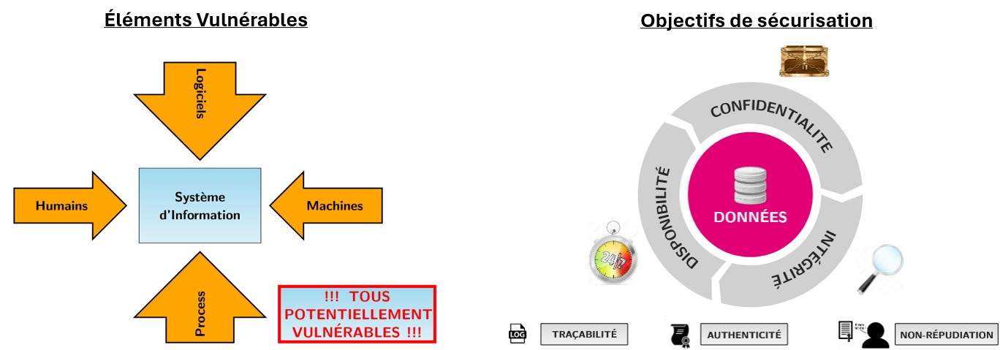
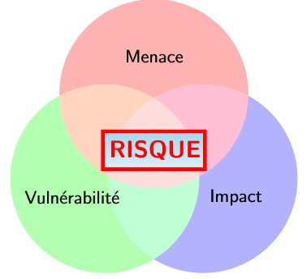
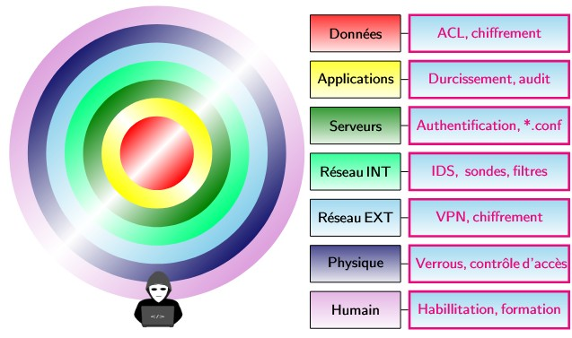
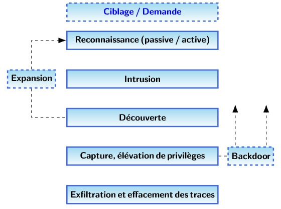
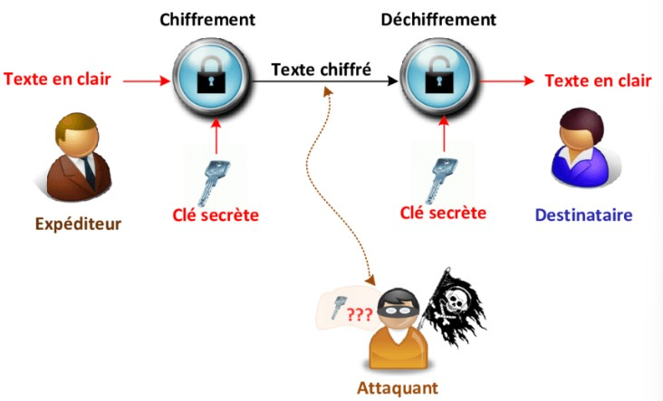
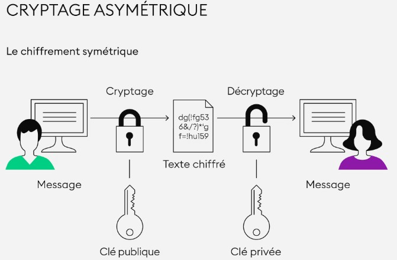
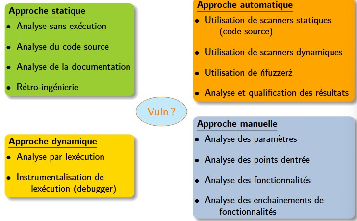
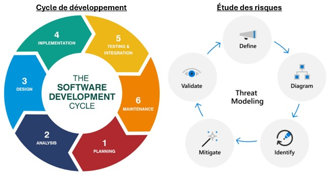

## Généralités

### Définitions

- **Système d'information / SI**: Le système d’information (SI) est un ensemble organisé desous-systèmes qui permet de collecter, stocker, traîter et / ou de distribuer de l’information.

- **Fuite de données** (Impact): Exposition d’informations confidentielles, sensibles ou protégées (de nature personnelles, bancaires, médicales, secrets commerciaux/industriels. . .) à une personne non autorisée. 

- **Défiguration** (Impact): Remplacer le contenu légitime par un autre contenu (message politique, dénigrer le propriétaire du site ou encore revendiquer son attaque comme preuve d’un savoir-faire).

- **Déni de service** (Impact): Site attaqué indisponible pour ses utilisateurs légitimes.

- **Bug (bogue)**: Défaut de conception ou de réalisation d’un programme (ou d’un matériel) informatique, qui se manifeste par des anomalies de fonctionnement de l’ordinateur.

- **Vulnérabilité**: Faute, par malveillance ou maladresse, dans les spécifications, la conception, la réalisation, l’installation ou la configuration d’un système, ou dans la façon de l’utiliser.

- **Code d'exploitation**: Tout ou partie d’un programme permettant d’utiliser une vulnérabilité ou un ensemble de vulnérabilités d’un logiciel (du système ou d’une application) à des fins malveillantes.

- **Exploit**: Représente une conjonction réelle entre les trois termes (bug, vulnérabilité et menace), matérialisant le risque dans la réalité.

- **Logiciel maveillant**: Tout programme développé dans le but de nuire au moyen d’un système informatique ou d’un réseau.

- **Faille 0-day**: Une vulnérabilité du jour zéro est une vulnérabilité informatique n’ayant fait l’objet d’aucune publication ou n’ayant aucun correctif connu. L’existence d’une telle faille sur un produit informatique implique qu’aucune protection n’existe, qu’elle soit palliative ou définitive.

- **Surface d'attaque**: Est la somme des vulnérabilités sur toute la profondeur d'un Système d'information.

- **Encodage**: Un encodage est un ensemble de règles bien définies qui déterminent comment des information sont convertis en une forme spécifique qui peut être stockée, transmise ou affichée. 

### Éléments vulnérables & Objectifs Sécurisation

| Éléments vulnérables 	|	| Objectifs Sécu	|
|        :-:        	|:-:|       :-:			|
| Humains   			|   | Confidentialité	|
| Logiciels 			|   | Disponibilité  	|
| Machines  			|   | Intégrité			|
| Process   			|   |       			|

### Menaces

1. Hacktiviste
2. Professionnel
3. Script kiddie
4. Cyberguerre

### Composition du Risque 

### Défense en Profondeur

### Scénario de pentest / attaque (6 phases)

1. *Ciblage / Demande*: Une cible est demandé (contrat) ou identifié (un SI, un site internet,...).
2. *Reconnaissance*: Une reconnaissance de cette cible est effectuer. Sites protégées? Quelle système utiliser? vulnérabilité connues? Qui sont les dirigeants... 
3. *Intrusion*: Selon les informations trouvés une phase d'intrusion est effectuer si possible (sinon besoin de + de recherches) en utilisant les vulnérabilités trouvé (humaines ou techniques).
4. *Decouverte*: Quand l'intrusion est réussi de nouvelles informations sont disponibles. A partir de la on peut retourner sur de la reconnaissances pour amélioré notre compréhension du système (phase 'Expansion') ou continuer l'attaque.
5. *Capture, élévation de privilèges*: On tentera de gagner plus de privilège pour avoir plus de pouvoir sur le systèmes et réalisé notre objectif. Préférablement, une **Backdoor** sera installé pour pouvoir plus facilement accéder au système pour une attaque future (ou si notre méthode d'accès se fait patch). 
6. *Exfiltration et effecement des traces*: Ici nous réaliseront notre objectif principale. Que se soit de l'exfiltration de donnée, suppression de données, chiffrement, modification ou autre... et enfin effacer les traces de notre passage pour éviter de se faire contre-hacker où que notre accès soit supprimé et patch.

### Règles de sécurité

- Ne jamais considérer un système comme sûr
- Suivre les bonnes pratiques de l’ANSSI (https://cyber.gouv.fr/publications/guide-des-bonnes-pratiques-de-linformatique)
- Intégrer la SSI dans toutes les étapes d’un projet
- Appliquer une défense en pronfondeur (https://cyber.gouv.fr/les-regles-de-securite)

## Encodage, Hash, Chiffrement

- Encodage -> Permet de transformer des donnée lisible par un humain (texte) en une forme lisible par les machine (binaire) et transmissible. Garantie la compatibilité entre différents systèmes et logiciels.
- Hash -> Crée un identifiant 'unique' à partir d'un algorithme/fonction de hashage (des colissions peuvent arrivé dans la théorie) permettant d'identifié une donnée (un programme, du texte,...). En comparrant on peut ainsi identifié si une donnée à été altéré ou pas (même hash = même donnée, pas le même hash = pas la même donnée). Aussi appelé l'**empreinte numérique** d'un fichier.
- Chiffrement -> Permet de rendre une donnée incompr"hensible et inutilisable pour quelqu'un n'ayant pas la clée de déchifrement. Permet de protéger les données contre les personne non-destinataire de la donnée.

### Encodage - Types

1. **ASCII (texte)**: American Standard Code for Information Interchange.
2. **UTF-8 (texte)**: Unicode Tranformation Format.
3. **Base64 (fichier/message)**: Données binaires sous forme d'ASCII.
4. **MP3/MP4/AAC (audio)**  
5. **AM/FM (audio)**: Radio (Amplitude Modulation / Frequency Modulation). 
6. **MPEG4 (vidéo)**
7. **DivX (vidéo)**
8. **JPEG (image)**
9. **PNG (image)**
10. **EXE (executable)**
11. ...

### Hash - Info

Un hash est ***UNIDIRECTIONNELLE***! Il est donc impossible de faire l'opération inverse de 'dé-hasher' un hash et trouver la donnée d'origine.

Il est néenmoins possible de *bruteforcé* le processus (notament pour les hashes de mots de passes) en hashant tout les possibles mots de passes existant et en comparant le résultat à notre hash cible. Si ils sont les même, alors nous avons trouvé le mot de passe. Pour ça il faut connaitre l'agorithme utilisé pour le hashage (normalement disponible en ligne sauf si custom).

### Hash - Type

1. **MD5**: Massage Digest Algorithm 5; le plus simple, rapide et moins sécurisé, possible collision (2 données différentes ont le même hash)
2. **SHA-1**: Secure Hash Algorithm 160-bits.
3. **SHA-256**: Secure Hash Algorithm 256-bits; *le plus utilisé pour la sécurité*.
4. **SHA-512**: Secure Hash Algorithm 512-bits.
5. ...

### Chiffrement - Type
1. **AES**: Chiffrement symétrique utilisant une seul clée pour le chiffrement et déchiffrement.

2. **RSA**: Chiffrement asymétrique utilisant deux clée. Une clée publique pour le chiffrement (issue d'une clée privé) et une clée privée pour le déchiffrement.

## Recherche de vulnérabilités (Application WEB)

### Composants cibles

- Navigateurs web et modules tiers
- Serveurs web
- Serveurs dapplication
- Autres services : SGBD, LDAP. . .
- Pare-feux applicatifs
- Configuration r´eseau
- Cryptographie
- ...

### OWASP

Open Web Application Security Project  
But: No more insecure software  
Missions:
    - Sensibiliser à la sécurisation web
	- Eduquer
	- Fournir des outils pour testé, évaluer et sécuriser
	- Standardiser des normes de dévelloppement sécurisées
	- Fédérer les acteurs à travers l'échange de connaissances 
	
Top vulnérabilités 2025 ("candidat") / https://owasp.org/Top10/2025/0x00_2025-Introduction/:
	1. Broken Access Control
	2. Security Misconfiguration (*NEW*)
	3. Sofware Supply Chain Failures
	4. Cryptographic Failures
	5. Injection
	6. Insecure DesignS
	7. Authentication Failures
	8. Sofware or Data Integrity Failures
	9. Logging and Alerting Failures
	10. Mishandling of Exceptional Conditions (*NEW*)
	
Top vulnérabilités 2021 / https://owasp.org/Top10/A00_2021_Introduction/:
	1. Broken Access Control
	2. Cryptographic Failures
	3. Injection
	4. Insecure Design
	5. Security Misconfiguration
	6. Vulnerable and Outdated Components
	7. Identification and Authentification Failures
	8. Software and Data Integrity Failures
	9. Security logging and Monitoring Failures
	10. Server Side Request Forgery (SSRF)

### Différentes approches

### Audit et test d'intrusion

**White Box** (Audit): Situation dans laquel vous accès complet sur le système à audité et notamment la documentation et accès au code source.

**Grey Box** (Audit ou test d'intrusion): Situation dans laquelle vous avez un accès partielle au système (comme une connection utilisateur pour vous identifié).

**Black Box** (Test d'intrusion): Situation dans laquelle vous n'avez aucun accès particulié à la cible. Permet de simulé une tentative d'intrusion plus réelle.

**Red Team**: Une équipe dont l'objectif est d'accédé à un système d'information a travers différents vecteurs (techniques, physique ou humain). Les attaquants. Très souvent exécuté en mode Black Box pour plus de réalisme.

**Blue Team**: Une équipe dont l'objectif est d'empécher et/ou détecter l'attaque de la Red Team. 

**Bug Bounty**: Chasse au bugs. Le bût est de trouvé une vulnérabilitée sur un système et être rémunéré par l'entreprise contre l'information de cette vunérabilité. Lancé par les entreprise elle-même.

### Cycle développement et risques

### Bonnes pratiques

- **Versionning (GIT)**: Historique des modifications (recherche origine du problème) et nouvelles branches (tester nouvelles fonctionalités)

- **Système de ticketing (REDMINE, GITLAB)**: Suivre, prioriser et corriger les bugs.

- **Utilisation d'analyseurs statique**: améliorer sa manière de coder.

- **Tests et environnements (dev-iso-prod, pre-prod)**: Écriture des tests par un collègue (séparation des responsabilités), vérification des APIS / valeurs limites, emploi d'outils d'intégration continue (CI - Tests systématiques avant chaque acceptation des modifications).

- **Mise en production (travailler de concert avec les admins)**: Éviter les modifications de dernière minutes vant mise en production, faire des tests post mise en production, et *être en capacité de faire machine arrière*.
 